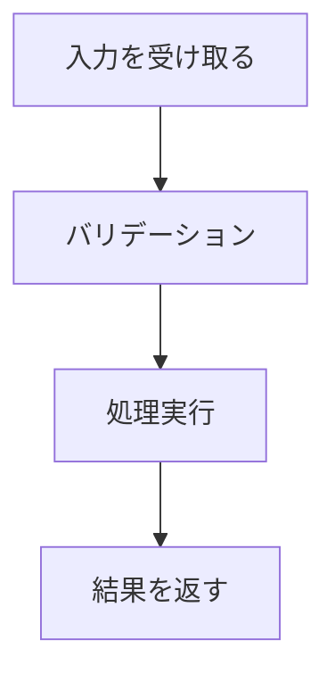

# 標準Markdown → Zenn変換ガイド

既存のmarkdownファイルをZenn形式に変換する際の手順。

## 変換対象パターン

### 1. 注意書き・補足をメッセージに

変換前:

```markdown
> **Note**: この機能は実験的です。

**注意**: 本番環境では使用しないでください。
```

変換後:

```markdown
:::message
この機能は実験的です。
:::

:::message alert
本番環境では使用しないでください。
:::
```

### 2. 長いコンテンツを折りたたみに

変換前:

```markdown
### 詳細な設定一覧

（長いテーブルや設定リスト）
```

変換後:

```markdown
:::details 詳細な設定一覧
（長いテーブルや設定リスト）
:::
```

### 3. コードブロックにファイル名追加

変換前:

````markdown
```javascript
// src/index.js
const app = require('./app');
```
````

変換後:

````markdown
```js:src/index.js
const app = require('./app');
```
````

### 4. 外部リンクをカード化

変換前:

```markdown
参考: [公式ドキュメント](https://example.com/docs)
```

変換後:

```markdown
参考:

https://example.com/docs
```

### 5. 動画・スライド埋め込み

変換前:

```markdown
動画: https://www.youtube.com/watch?v=xxxxx
```

変換後:

```markdown
@[youtube](xxxxx)
```

### 6. 数式変換

変換前:

```markdown
E = mc^2
```

変換後:

```markdown
$E = mc^2$
```

### 7. フローチャート変換

変換前:

```markdown
処理フロー:
1. 入力を受け取る
2. バリデーション
3. 処理実行
4. 結果を返す
```

変換後:

````markdown

````

## 変換チェックリスト

- [ ] `> **Note**:` → `:::message`
- [ ] `> **Warning**:` / `> **注意**:` → `:::message alert`
- [ ] 長いセクション → `:::details`
- [ ] コードブロックにファイル名追加
- [ ] 単独リンク → リンクカード
- [ ] YouTube URL → `@[youtube](ID)`
- [ ] GitHub Gist URL → `@[gist](user/id)`
- [ ] 数式 → KaTeX記法
- [ ] フローチャート → mermaid
- [ ] HTMLタグ削除（`<br>`以外）
- [ ] 画像に適切なaltテキスト設定
- [ ] 画像幅の調整（必要に応じて）

## 自動検出パターン

以下のパターンを検出したらZenn記法への変換を検討:

| 検出パターン | 変換先 |
| ------------ | ------ |
| `> **Note**` | `:::message` |
| `> **Warning**` | `:::message alert` |
| `> **注意**` | `:::message alert` |
| `<details>` | `:::details` |
| `youtube.com/watch` | `@[youtube]` |
| `gist.github.com` | `@[gist]` |
| `codepen.io` | `@[codepen]` |
| `figma.com` | `@[figma]` |

## 変換時の注意

- HTMLタグは基本的に削除（`<br>`のみ残す）
- アンダースコア含むURLはリンクカードで認識されない場合あり
- mermaidは文字数制限があるため、複雑な図は画像化を検討
- 変換後は必ずプレビューで表示確認
