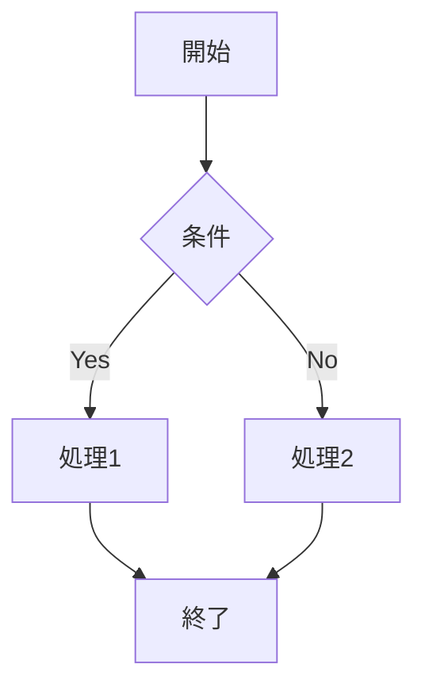
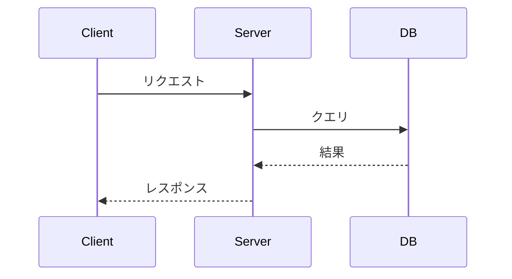
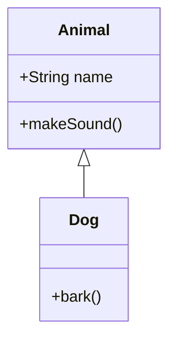
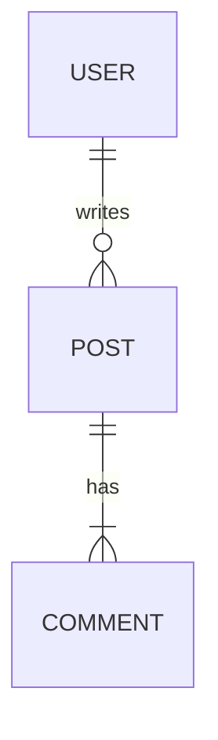

# 数式とダイアグラム

KaTeX数式とmermaidダイアグラムについて。

## 数式（KaTeX）

ZennはKaTeXをサポート。

### ブロック数式

独立した行に数式を表示。

```markdown
$$
e^{i\pi} + 1 = 0
$$
```

### インライン数式

文中に数式を埋め込む。

```markdown
ピタゴラスの定理は $a^2 + b^2 = c^2$ で表される。
```

### よく使う記法

| 記法 | 出力 | 説明 |
| ---- | ---- | ---- |
| `x^2` | x² | 上付き |
| `x_i` | xᵢ | 下付き |
| `\frac{a}{b}` | a/b | 分数 |
| `\sqrt{x}` | √x | 平方根 |
| `\sum_{i=1}^{n}` | Σ | 総和 |
| `\int_{a}^{b}` | ∫ | 積分 |
| `\alpha, \beta` | α, β | ギリシャ文字 |
| `\rightarrow` | → | 矢印 |

### 複数行数式

```markdown
$$
\begin{aligned}
f(x) &= ax^2 + bx + c \\
     &= a(x - p)^2 + q
\end{aligned}
$$
```

## mermaid

フローチャートやシーケンス図を作成。

### フローチャート

````markdown

````

### シーケンス図

````markdown

````

### クラス図

````markdown

````

### ER図

````markdown

````

## mermaid制限事項

Zennでのmermaid使用には以下の制限がある:

- ブロックあたり2000文字以内
- Chain数（矢印の連鎖）10以下
- クリックイベント無効化

### 制限回避策

- 複雑な図は複数のブロックに分割
- 詳細は外部ツール（draw.io等）で作成し画像として貼り付け
- 必要最小限の要素に絞る

## 使い分け

| 用途 | 推奨 |
| ---- | ---- |
| 数学的表現 | KaTeX |
| フロー・手順 | mermaid flowchart |
| API連携 | mermaid sequence |
| データ構造 | mermaid ER/class |
| 複雑な図 | 外部ツール + 画像 |
